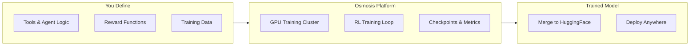

Osmosis is a platform for training LLMs through reinforcement learning with custom tools and evaluation logic. You define how your agent should behave — the tools it can use, how its outputs are scored, and what data it trains on — and Osmosis handles the GPU infrastructure, training loops, and model management.

The result: models that get measurably better at your specific tasks over time, without manual fine-tuning.

## How It Works

## Get Started

<CardGroup cols={2}>
  <Card title="Platform Guide" icon="grid-2" href="/platform/overview">
    Learn about the Osmosis Platform — workspaces, training runs, metrics, and model management.
  </Card>
  <Card title="Python SDK" icon="python" href="/python-sdk/introduction">
    Install the SDK to build reward functions, agent loops, and CLI tools for local testing.
  </Card>
  <Card title="Remote Rollout" icon="server" href="/remote-rollout/overview">
    Build custom agent servers that integrate with Osmosis training infrastructure.
  </Card>
  <Card title="Git Sync" icon="code-branch" href="/git-sync/overview">
    Sync reward functions, rubrics, and MCP tools from your GitHub repository.
  </Card>
</CardGroup>

## Choose Your Workflow

Osmosis supports two main workflows for connecting your code to the training platform:

| | Git Sync | Remote Rollout |
|---|---|---|
| **Best for** | Reward functions, rubrics, MCP tools | Custom agent loops with complex logic |
| **How it works** | Push to GitHub → auto-synced to platform | Run your own HTTP server → platform connects |
| **Setup** | Add decorators + folder structure | Implement `RolloutAgentLoop` |
| **When to use** | Standard tool-use training | Multi-step reasoning, custom environments |

## Quick Links

- [Sign up for Osmosis](https://platform.osmosis.ai)
- [Example repositories on GitHub](https://github.com/Osmosis-AI)
- [Contact us](mailto:contact@osmosis.ai)
