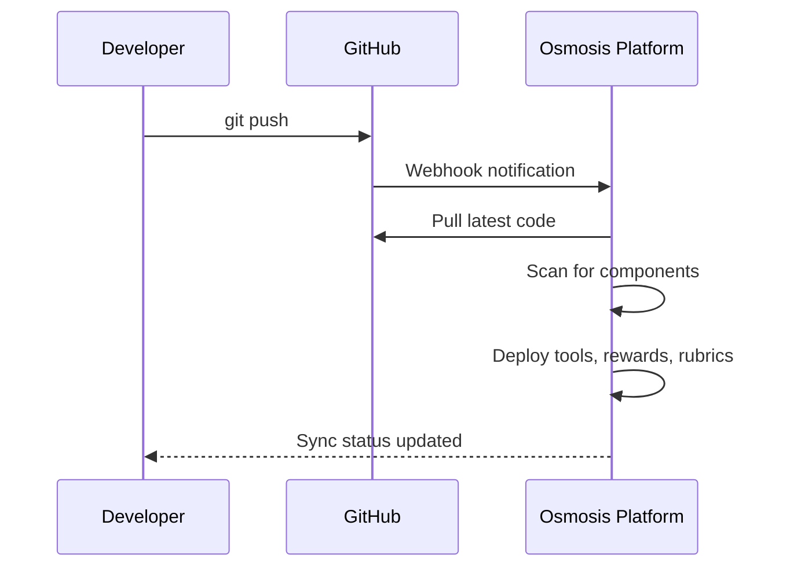

The Osmosis GitHub integration automatically syncs MCP tools, reward functions, and reward rubrics from your repository to the platform. When you push changes, Osmosis detects and deploys your updated components.

## Installing the GitHub App

<Steps>
  <Step title="Navigate to Git Settings">
    Go to [platform.osmosis.ai](https://platform.osmosis.ai) → **Settings** → **Workspace** → **Git**
  </Step>
  <Step title="Connect GitHub">
    Click **Connect Repository** and authorize the Osmosis GitHub App. You can grant access to all repositories or select specific ones.
  </Step>
  <Step title="Select Repository">
    Choose the repository you want to sync. Both public and private repositories are supported.
  </Step>
  <Step title="Confirm Connection">
    Click **Connect**. Osmosis will perform an initial sync and discover your components.
  </Step>
</Steps>

## How Auto-Sync Works

Once connected, the sync process is automatic:

1. **You push** code to your repository (any branch configured for sync)
2. **GitHub sends a webhook** to the Osmosis platform
3. **Osmosis pulls** the latest code and scans for components
4. **Components are deployed** — tools, reward functions, and rubrics become available for training runs

## What Gets Synced

Osmosis discovers components based on the [folder structure](/git-sync/folder-structure):

| Folder | Component Type | Detection |
|--------|---------------|-----------|
| `mcp/` | MCP Tools | `@mcp.tool()` decorated functions |
| `reward_fn/` | Reward Functions | `@osmosis_reward` decorated functions |
| `reward_rubric/` | Reward Rubrics | `@osmosis_rubric` decorated functions |

Dependencies are read from `pyproject.toml` in the repository root.

## Sync Status Dashboard

After connecting a repository, the sync dashboard shows:

- **Last sync time** — When the most recent sync completed
- **Sync status** — Success, failed, or in progress
- **Discovered components** — List of tools, reward functions, and rubrics found
- **Sync history** — Log of recent sync events with details

## Managing Connected Repositories

From **Settings → Workspace → Git**:

- **View** all connected repositories and their sync status
- **Trigger manual sync** if you need to force a re-sync
- **Disconnect** a repository to stop syncing

## Troubleshooting

<AccordionGroup>
  <Accordion title="Sync not triggering after push">
    - Verify the Osmosis GitHub App is installed on the repository
    - Check that the webhook is active in GitHub → Repository Settings → Webhooks
    - Ensure you're pushing to the branch configured for sync
    - Try triggering a manual sync from the platform dashboard
  </Accordion>
  <Accordion title="Components not discovered">
    - Confirm your [folder structure](/git-sync/folder-structure) matches the expected layout
    - Check that decorators are applied correctly (`@mcp.tool()`, `@osmosis_reward`, `@osmosis_rubric`)
    - Verify `pyproject.toml` lists all required dependencies
    - Review sync logs for import errors
  </Accordion>
  <Accordion title="Private repository access denied">
    - Re-authorize the GitHub App and ensure it has access to the specific repository
    - Check repository permissions in GitHub → Settings → GitHub Apps → Osmosis
    - For organization repositories, ensure an admin has approved the app installation
  </Accordion>
  <Accordion title="Sync shows errors">
    - Check the sync logs on the dashboard for specific error messages
    - Common issues: missing dependencies in `pyproject.toml`, syntax errors in Python files, missing `__init__.py` files
    - Test your code locally before pushing: `pip install -e . && python -c "from reward_fn.compute_reward import *"`
  </Accordion>
</AccordionGroup>

## Next Steps

<CardGroup cols={2}>
  <Card title="Folder Structure" icon="folder-tree" href="/git-sync/folder-structure">
    Required repository layout for Git Sync
  </Card>
  <Card title="Sync to Platform" icon="rocket" href="/git-sync/sync-repository-to-platform">
    Step-by-step setup guide
  </Card>
</CardGroup>
