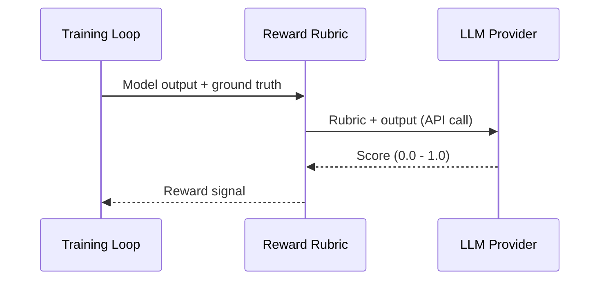

LLM Judges are reward rubrics that use external LLM providers to evaluate model outputs during training. Instead of writing deterministic scoring logic, you describe evaluation criteria in natural language and an LLM scores the output.

## How LLM Judges Work

1. During a training rollout, the model generates a response
2. The response is sent to an LLM provider (OpenAI, Anthropic, Google, etc.) along with your rubric
3. The LLM evaluates the response against your criteria and returns a score
4. The score is used as the reward signal for RL training

## Configuring API Keys

LLM judges require API keys for the providers you want to use (OpenAI, Anthropic, Google, xAI, etc.). Configure these in **Settings → Workspace → LLM Providers**.

See [Workspace Settings](/platform/workspace-settings#llm-provider-keys) for details on managing provider keys.

## Next Steps

<CardGroup cols={2}>
  <Card title="Reward Rubrics" icon="file-lines" href="/git-sync/reward-rubrics">
    Write and test rubrics with the `@osmosis_rubric` decorator
  </Card>
  <Card title="Workspace Settings" icon="gear" href="/platform/workspace-settings">
    Manage API keys and provider configuration
  </Card>
</CardGroup>
