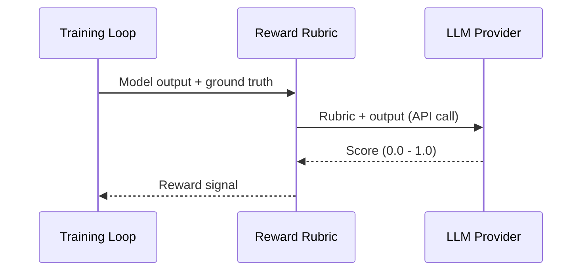

LLM Judges are reward rubrics that use external LLM providers to evaluate model outputs during training. Instead of writing deterministic scoring logic, you describe evaluation criteria in natural language and an LLM scores the output.

## How LLM Judges Work

1. During a training rollout, the model generates a response
2. The response is sent to an LLM provider (OpenAI, Anthropic, Google, etc.) along with your rubric
3. The LLM evaluates the response against your criteria and returns a score
4. The score is used as the reward signal for RL training



## Adding API Keys

LLM judges require API keys for the providers you want to use. Configure these in the platform:

1. Go to **Settings** → **Workspace** → **LLM Providers**
2. Add API keys for your chosen providers

### Supported Providers

| Provider | Models | Key Format |
|----------|--------|------------|
| OpenAI | `gpt-5.2`, `gpt-5.2-pro`, `gpt-5-mini` | `sk-...` |
| Anthropic | `claude-sonnet-4-5`, `claude-opus-4-5`, `claude-haiku-4-5` | `sk-ant-...` |
| Google | `gemini-2.5-flash`, `gemini-2.5-pro` | Google AI API key |
| xAI | `grok-4` | xAI API key |

<Warning>
API keys are stored securely and encrypted at rest. They are only used during training runs to evaluate reward rubrics. Never commit API keys to your repository.
</Warning>

## How Keys Are Used During Training

When a training run uses reward rubrics:

1. The platform retrieves your stored API key for the specified provider
2. The key is injected securely into the training environment
3. Rubric evaluation calls are made to the provider's API
4. Keys are never exposed in logs or to the training model itself

## Writing Reward Rubrics

Reward rubrics are defined in your repository using the `@osmosis_rubric` decorator:

```python
from osmosis_ai import evaluate_rubric, osmosis_rubric
import os

RUBRIC = """
Evaluate the response for:
1. Correctness - Does the answer match the expected output?
2. Completeness - Are all parts of the question addressed?
3. Clarity - Is the response clear and well-structured?

Score from 0.0 (completely wrong) to 1.0 (perfect).
"""

@osmosis_rubric
def quality_rubric(
    solution_str: str,
    ground_truth: str,
    extra_info: dict,
    **kwargs  # Required for platform compatibility
) -> float:
    result = evaluate_rubric(
        rubric=RUBRIC,
        solution_str=solution_str,
        model_info={
            "provider": "openai",
            "model": "gpt-5.2",
            "api_key": os.getenv("OPENAI_API_KEY"),
        },
        ground_truth=ground_truth,
        metadata=extra_info.get("metadata"),
        score_min=0.0,
        score_max=1.0,
        return_details=False,
    )
    return float(result)
```

Sync rubrics to the platform via [Git Sync](/git-sync/reward-rubrics) or test them locally with the SDK.

## Testing Rubrics

### From the CLI

```bash
# Test a rubric locally
python -c "
from reward_rubric.my_rubric import quality_rubric
score = quality_rubric('The answer is 42', '42', {})
print(f'Score: {score}')
"
```

### From the Platform

Once synced, you can test rubrics directly from the platform UI:

1. Navigate to **Reward Rubrics** in your project
2. Select a rubric
3. Enter a test input and ground truth
4. Click **Test** to see the score

## Next Steps

<CardGroup cols={2}>
  <Card title="Reward Rubrics" icon="file-lines" href="/git-sync/reward-rubrics">
    Writing rubrics with the `@osmosis_rubric` decorator
  </Card>
  <Card title="Workspace Settings" icon="gear" href="/platform/workspace-settings">
    Manage API keys and provider configuration
  </Card>
</CardGroup>
