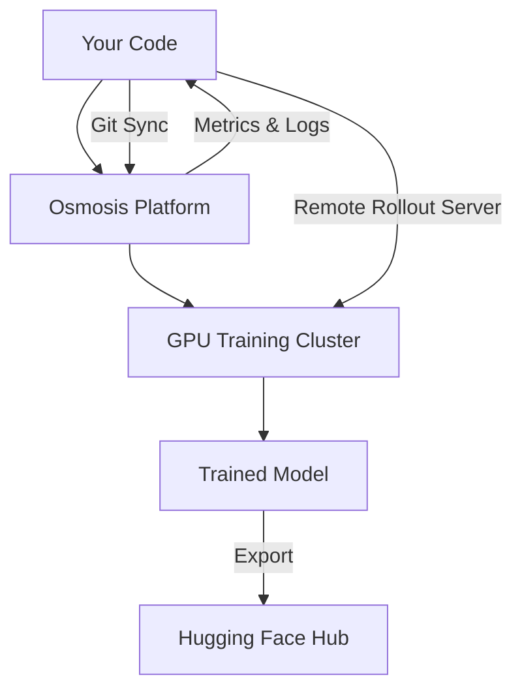

[Osmosis Platform](https://platform.osmosis.ai) is the central hub for managing reinforcement learning training of LLMs. It handles GPU provisioning, training orchestration, metrics collection, and model management — so you can focus on defining agent behavior and evaluation logic.

## Core Concepts

| Concept | Description |
|---------|-------------|
| **Workspace** | Top-level container for your team. Holds projects, members, API keys, and integrations. |
| **Project** | A training context within a workspace. Contains training runs, reward functions, tools, and datasets. |
| **Training Run** | A single RL training session. Configured with a base model, dataset, reward functions, and tools. |
| **Reward Function** | Python function that scores LLM outputs deterministically. Returns a float. |
| **Reward Rubric** | Natural language criteria evaluated by an LLM judge during training. |
| **MCP Tools** | Functions the agent can call during rollouts (calculators, search, code execution, etc.). |
| **Checkpoint** | A saved model state during training. Can be merged and exported to Hugging Face. |

## Architecture

Your code connects to the platform in two ways:

1. **Git Sync** — Push reward functions, rubrics, and MCP tools to GitHub. The platform auto-syncs them via webhook.
2. **Remote Rollout** — Run an HTTP server implementing your agent loop. The training cluster calls your server during rollouts.

The platform manages everything else: provisioning GPUs, running the RL training loop, collecting metrics, saving checkpoints, and exporting models.

## Feature Summary

<CardGroup cols={2}>
  <Card title="Training Runs" icon="play" href="/platform/training-runs">
    Configure and launch RL training with custom models, datasets, and rewards.
  </Card>
  <Card title="Monitoring" icon="chart-line" href="/platform/monitoring">
    Real-time metrics, training logs, and checkpoint management.
  </Card>
  <Card title="GitHub Integration" icon="github" href="/platform/github-integration">
    Connect repositories for automatic sync of tools, rewards, and rubrics.
  </Card>
  <Card title="LLM Judges" icon="scale-balanced" href="/platform/llm-judges">
    Configure LLM providers for reward rubric evaluation.
  </Card>
  <Card title="Workspace & Team" icon="users" href="/platform/workspace-settings">
    Manage members, API keys, and integrations.
  </Card>
  <Card title="Getting Started" icon="rocket" href="/platform/quickstart">
    Sign up, create a project, and launch your first training run.
  </Card>
</CardGroup>

## Choose Your Workflow

<CardGroup cols={2}>
  <Card title="Git Sync" icon="code-branch" href="/git-sync/overview">
    **Best for: reward functions, rubrics, and MCP tools**

    Define evaluation logic in your repository. Push to GitHub and Osmosis auto-syncs everything. No server to manage.
  </Card>
  <Card title="Remote Rollout" icon="server" href="/remote-rollout/overview">
    **Best for: custom agent loops with complex logic**

    Build an HTTP server implementing your agent loop. The training cluster connects to your server during rollouts.
  </Card>
</CardGroup>
