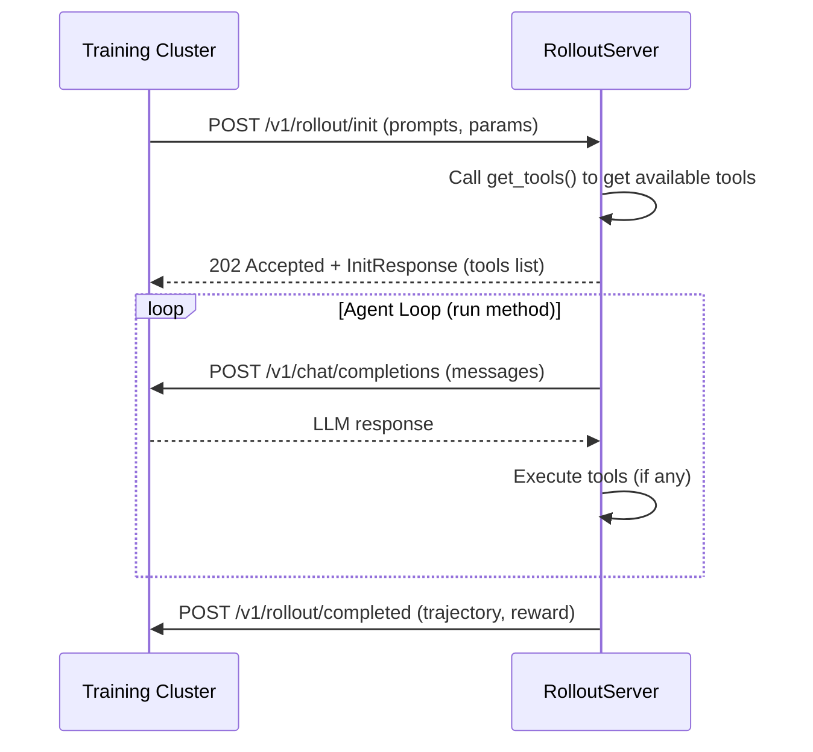

Remote Rollout enables you to create custom agent implementations that integrate seamlessly with Osmosis training infrastructure. Your agent runs as an HTTP server while the training cluster handles LLM inference and trajectory collection.

<Note>
**Prerequisites**: You need an [Osmosis Platform account](/platform/quickstart) and the SDK installed (`pip install osmosis-ai[server]`). Authenticate with `osmosis login`, then register your rollout server URL on [platform.osmosis.ai](https://platform.osmosis.ai) when ready to train.
</Note>

## What is Remote Rollout?

Remote Rollout separates agent trajectory generation from training infrastructure:

<CardGroup cols={2}>
  <Card title="Training Cluster" icon="server">
    Hosts LLM inference (`/v1/chat/completions`) and receives rollout results (`/v1/rollout/completed`)
  </Card>
  <Card title="RolloutServer (Your Code)" icon="code">
    Implements agent loop with tools, delegates protocol handling to the SDK
  </Card>
</CardGroup>

This architecture allows you to:

- **Define custom tools** - Implement any tools your agent needs (calculators, web search, code execution, etc.)
- **Control agent logic** - Build sophisticated agent loops with custom reasoning
- **Collect training data** - Automatically gather trajectories for reinforcement learning
- **Scale independently** - Run multiple agent servers without modifying training infrastructure

## How It Works



### Protocol Flow

1. **Init Rollout (`/v1/rollout/init`)**:
   - Training cluster sends initial messages and parameters
   - SDK calls your `get_tools()` method
   - Returns `202 Accepted` with `InitResponse` containing the **tools list**
   - This tells the training cluster what tools are available for this rollout

2. **Agent Loop (`run()` method)**:
   - Your code alternates between LLM calls and tool execution
   - Uses `ctx.chat()` to call the training cluster's LLM endpoint

3. **Complete (`/v1/rollout/completed`)**:
   - Send final trajectory back to training
   - Include reward **only if** platform is configured to compute reward in remote rollout

## Installation

```bash
# Basic installation
pip install osmosis-ai

# With server support (FastAPI + uvicorn) - Required for RolloutServer
pip install osmosis-ai[server]
```

## Quick Example

Here's a minimal agent that uses calculator tools:

```python
from osmosis_ai.rollout import (
    RolloutAgentLoop,
    RolloutContext,
    RolloutResult,
    RolloutRequest,
    create_app,
)

class CalculatorAgent(RolloutAgentLoop):
    name = "calculator"  # REQUIRED: unique identifier

    # REQUIRED: Called when /v1/rollout/init is received
    # Returns tools to include in the InitResponse
    def get_tools(self, request: RolloutRequest):
        return [
            {
                "type": "function",
                "function": {
                    "name": "add",
                    "description": "Add two numbers",
                    "parameters": {
                        "type": "object",
                        "properties": {
                            "a": {"type": "number"},
                            "b": {"type": "number"}
                        },
                        "required": ["a", "b"]
                    }
                }
            }
        ]

    # REQUIRED: Main agent loop executed after init
    async def run(self, ctx: RolloutContext) -> RolloutResult:
        messages = list(ctx.request.messages)

        for _ in range(ctx.request.max_turns):
            # Call LLM through training cluster
            result = await ctx.chat(messages)
            messages.append(result.message)

            if not result.has_tool_calls:
                break

            # Execute tools
            for tool_call in result.tool_calls:
                tool_result = await self.execute_tool(tool_call)
                messages.append(tool_result)
                ctx.record_tool_call()  # OPTIONAL: for metrics

        # reward=None means no reward computed here
        # Set reward=<float> if platform expects reward from rollout server
        return ctx.complete(messages)

# Create FastAPI app
app = create_app(CalculatorAgent())
```

<Tip>
The `get_tools()` method is called automatically by the SDK when `/v1/rollout/init` is received. The returned tools are included in the `InitResponse` sent back to the training cluster.
</Tip>

Run with:

```bash
osmosis serve -m my_agent:app
```

## Example Repository

We provide a complete example repository you can use as a starting point:

<Card 
  title="osmosis-remote-rollout-example" 
  icon="github" 
  href="https://github.com/Osmosis-AI/osmosis-remote-rollout-example"
>
  Full calculator agent example with tools, rewards, and test datasets
</Card>

The example includes:
- Complete agent loop implementation
- Tool definitions and execution
- Reward function with `@osmosis_reward` decorator
- Test dataset in Parquet format
- CLI usage examples

## Key Features

### SDK CLI Commands

The SDK provides CLI commands to simplify development:

| Command | Description |
|---------|-------------|
| `osmosis serve` | Start a RolloutServer with validation |
| `osmosis validate` | Validate agent loop without starting server |
| `osmosis test` | Test agent against datasets using cloud LLMs |

### Debug Logging

Enable execution tracing for debugging:

```bash
osmosis serve -m server:agent_loop --log ./rollout_logs
```

Each rollout writes JSONL traces including LLM calls, tool executions, and final results.

### Test Mode

Test your agent locally with external LLM providers before deploying:

```bash
# Batch testing
osmosis test -m server:agent_loop -d dataset.parquet

# Interactive debugging
osmosis test -m server:agent_loop -d dataset.parquet --interactive
```

## Next Steps

<CardGroup cols={2}>
  <Card title="Quick Start" icon="rocket" href="/remote-rollout/quickstart">
    Build your first agent in 5 minutes
  </Card>
  <Card title="Agent Loop Guide" icon="code" href="/remote-rollout/agent-loop">
    Deep dive into RolloutAgentLoop implementation
  </Card>
  <Card title="Test Mode" icon="flask" href="/remote-rollout/test-mode">
    Test agents locally with cloud LLMs
  </Card>
  <Card title="CLI Reference" icon="terminal" href="/python-sdk/cli-reference#remote-rollout-commands">
    Complete CLI documentation
  </Card>
</CardGroup>
